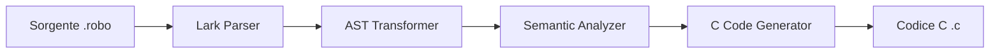

# Specifiche Formali e Documentazione Tecnica (roboLang)

Questo documento descrive le specifiche formali del linguaggio **roboLang** e la struttura interna del compilatore sviluppato in Python per il corso di *Elementi di Ingegneria dei Linguaggi di Programmazione* (A.A. 2025/26).

---

## 1. Specifiche del Linguaggio roboLang

**roboLang** è un linguaggio orientato a sistemi reattivi, automazione e robotica. È progettato per essere semplice ma robusto, implementando costrutti decisionali condizionali e reattivi in linea con lo stato dei moderni controllori industriali.

### 1.1 Sintassi Lessicale e Tipi di Dato
Il linguaggio supporta quattro tipi di dato fondamentali:
*   `int`: Interi con segno (es. `10`, `-5`).
*   `real`: Numeri a virgola mobile a doppia precisione (es. `3.14`, `-0.01`). Vengono mappati al tipo `double` in C per garantire precisione computazionale.
*   `bool`: Valori booleani (`true`, `false`).
*   `string`: Stringhe letterali racchiuse tra virgolette doppie (es. `"Calcolo in corso..."`).

### 1.2 Grammatica EBNF (in sintassi Lark)
La grammatica formale è definita in [grammar.py](file:///C:/Users/ettor/PycharmProjects/PythonProject1/src/grammar.py):
```lark
start: (task_decl | stmt)*

task_decl: "task" CNAME "(" param_list? ")" ("->" TYPE)? "{" stmt* "}"
param_list: param ("," param)*
param: CNAME ":" TYPE

?stmt: var_decl
     | set_stmt
     | when_stmt
     | while_stmt
     | call_stmt
     | return_stmt
     | log_stmt

var_decl: "var" CNAME ":" TYPE "=" expr ";"
set_stmt: "set" CNAME "=" expr ";"
when_stmt: "when" "(" expr ")" "{" stmt* "}"
while_stmt: "while" "(" expr ")" "{" stmt* "}"
call_stmt: CNAME "(" expr_list? ")" ";"
return_stmt: "return" expr? ";"
log_stmt: "log" "(" expr ")" ";"

TYPE: "int" | "real" | "bool" | "string"

%import common.SH_COMMENT
%ignore SH_COMMENT
```
I commenti a riga singola sono introdotti dal carattere `#` e vengono scartati durante il parsing grazie alla direttiva `%ignore SH_COMMENT`.

### 1.3 Funzioni Built-in per l'Input Utente
Per consentire l'interattività e l'acquisizione di parametri in tempo reale, il compilatore pre-registra nello scope globale due funzioni built-in:
*   `read_int() -> int`: Legge un valore intero da terminale via `scanf` in C.
*   `read_real() -> real`: Legge un valore double/real da terminale via `scanf` in C.

---

## 2. Architettura del Compilatore

Il compilatore è strutturato in modo modulare:



1.  **Parsing ([src/grammar.py](file:///C:/Users/ettor/PycharmProjects/PythonProject1/src/grammar.py)):** Il parser LALR(1) di Lark legge il sorgente ed effettua l'analisi sintattica generando un albero di parsing.
2.  **Generazione dell'AST ([src/transformer.py](file:///C:/Users/ettor/PycharmProjects/PythonProject1/src/transformer.py) e [src/ast_nodes.py](file:///C:/Users/ettor/PycharmProjects/PythonProject1/src/ast_nodes.py)):** Un trasformatore converte l'albero sintattico in un Abstract Syntax Tree. Le espressioni con precedenze multiple (es. precedenza degli operatori aritmetici) e con molteplici termini vengono risolte e strutturate ricorsivamente a sinistra tramite la funzione `_fold_binops`. Viene inoltre gestita la notazione esponenziale (`5e3`) promuovendola a tipo `real`.
3.  **Analisi Semantica ([src/semantic.py](file:///C:/Users/ettor/PycharmProjects/PythonProject1/src/semantic.py)):**
    *   **Visitor Pattern & Dispatch Dinamico:** Tutte le analisi e la generazione del codice sfruttano il Visitor Pattern. Ogni nodo in [ast_nodes.py](file:///C:/Users/ettor/PycharmProjects/PythonProject1/src/ast_nodes.py) espone `accept(visitor)` che delega il dispatch dinamico a runtime tramite la funzione `getattr(self, f"visit_{...}")`.
    *   **Scope Checking ([src/scope.py](file:///C:/Users/ettor/PycharmProjects/PythonProject1/src/scope.py)):** Esegue l'analisi in **due passate** per registrare le firme delle funzioni prima dei corpi (permettendo la mutua ricorsione). Gestisce la tabella dei simboli locale e globale, controlla lo shadowing dei parametri (tramite set locale dedicato), e impedisce l'uso di variabili non dichiarate anche all'interno di espressioni complesse (`_check_expr`).
    *   **Type Checking ([src/typechecker.py](file:///C:/Users/ettor/PycharmProjects/PythonProject1/src/typechecker.py)):** Controlla la compatibilità dei tipi. Consente la coercizione implicita da `int` a `real` (widening). Valida la tipizzazione forte degli operandi per evitare operazioni non numeriche (es. stringa + numero).
4.  **Generazione del Codice ([src/codegen.py](file:///C:/Users/ettor/PycharmProjects/PythonProject1/src/codegen.py)):** Un visitor traduce l'AST in codice C99. Raccoglie preventivamente tutti i task emettendo le **forward declarations** (prototipi) in cima al file per evitare warning di dichiarazione implicita da `gcc`. Implementa poi le funzioni built-in ed effettua il mapping diretto dei tipi (`real` -> `double`, `string` -> `char*`).

---

## 3. Suite di Test e Verifica

La suite di test integrata in [tests/test_compiler.py](file:///C:/Users/ettor/PycharmProjects/PythonProject1/tests/test_compiler.py) conta **17** test automatizzati e verifica:
*   Corretto folding delle espressioni lunghe (associatività a sinistra).
*   Precedenza degli operatori (es. `1 + 2 * 3` viene tradotto con la corretta precedenza moltiplicativa).
*   Coercizione di tipo da `int` a `real` e classificazione dei valori esponenziali.
*   Risoluzione degli errori semantici (variabili non dichiarate in sotto-espressioni, parametri duplicati, tipi incompatibili, mismatch del tipo di ritorno).
*   Shadowing valido di variabili globali tramite parametri locali.
*   Corretto inserimento di forward declarations ed eliminazione di avvisi di implicit declaration.
*   Esclusione e supporto sintattico per i commenti `#`.
*   Generazione sintatticamente corretta del codice C.

Per eseguire l'intera suite:
```bash
python -m unittest tests/test_compiler.py
```
